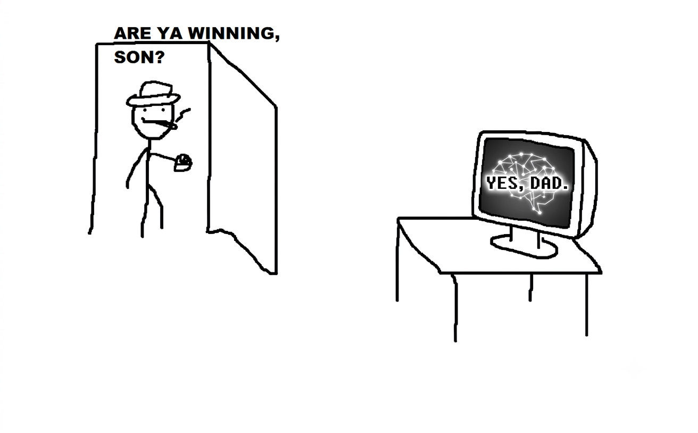

# AI-Generated Game Walkthroughs

Walkthrough drafts generated by AI, then checked against public references and, where available, a locally owned copy of the game.

This is deliberately not presented as an official guide, a replacement for the original manual, or a claim of perfect completion. Each guide states its game build, evidence boundary, unresolved ambiguity, and what still needs a real runtime verification pass.

## What Is Here

- Original, command-first walkthrough notes.
- Location and interface context needed between commands.
- Score and verification checklists.
- Links to source material used for cross-checking.

## What Is Not Here

- Game executables, resource files, extracted scripts, manuals, artwork, maps, screenshots, or music.
- Copied walkthrough prose from third-party guides.
- Claimed world records or “perfect” scores without an attached run log.

## Current Guides

- [Police Quest I: In Pursuit of the Death Angel (1987 AGI)](walkthroughs/police-quest-1-agi.md)

## Contribution Rule

Treat every guide as a reproducible research note. Add the exact game build, command accepted by the parser, observed score delta, save-state reference, and source links. Do not upload game assets or reproduce another author’s guide.

## License

The original explanatory text in this repository is released under [CC BY 4.0](https://creativecommons.org/licenses/by/4.0/). Game names, game materials, and external sources remain the property of their respective owners.
